# 💰 Expense Tracker App

A modern **Expense Tracker Web Application** built using the **MERN Stack** that helps users manage their income and expenses, track transactions, and understand their financial activity through an interactive dashboard.

## 📸 Screenshots

### 🏠 Dashboard

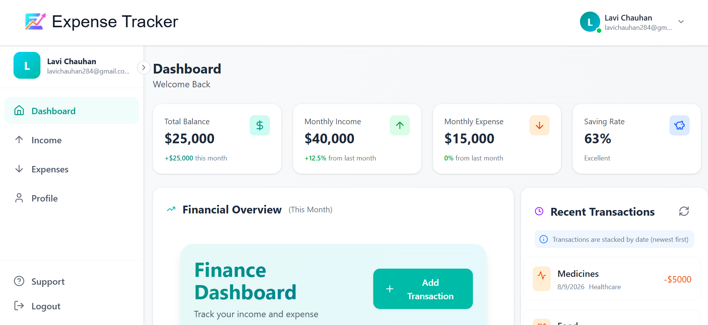
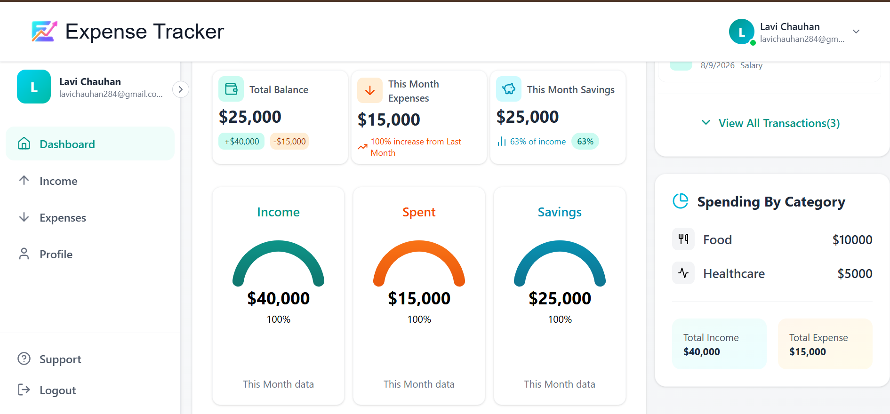
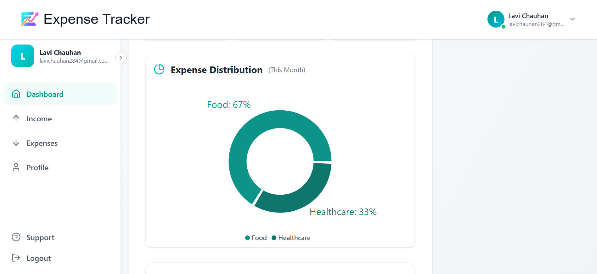
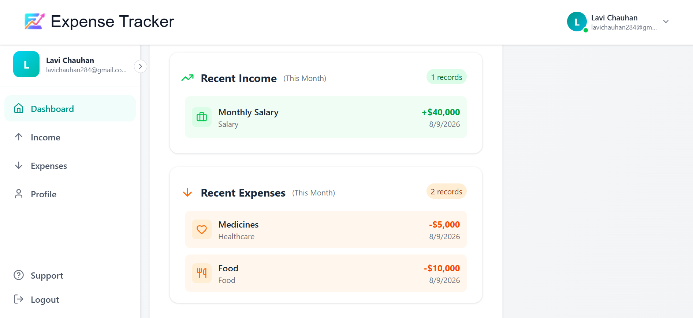
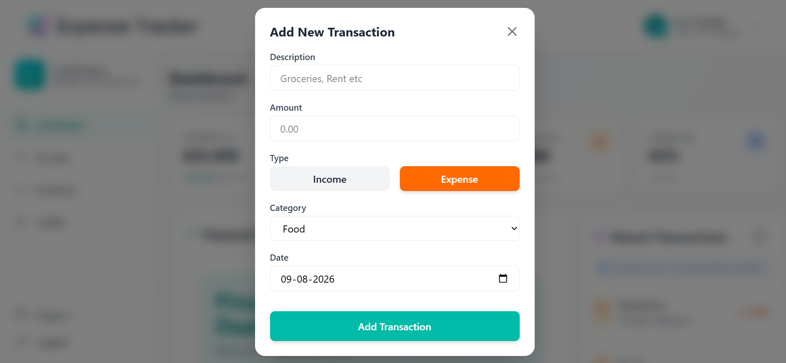

The dashboard provides an overview of:

* Total Income
* Total Expenses
* Current Balance / Savings
* Monthly financial summary
* Recent transactions
* Financial charts

### 💵 Income Management

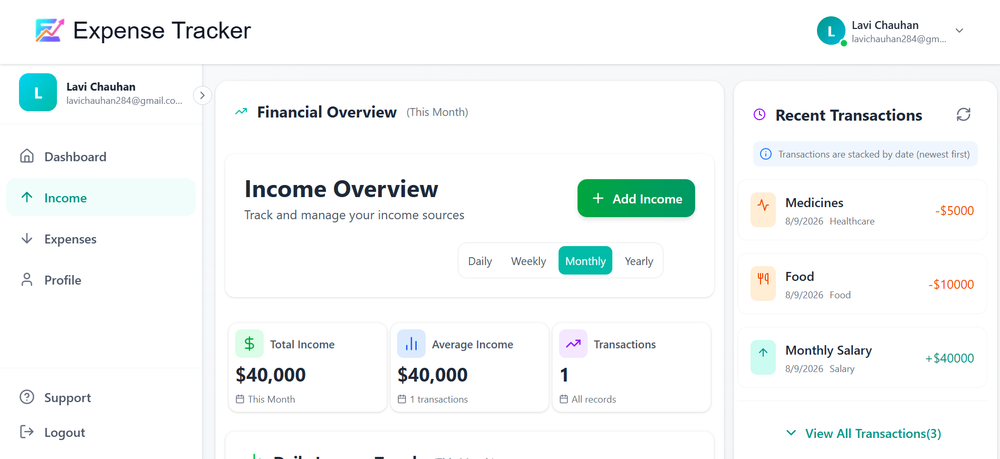
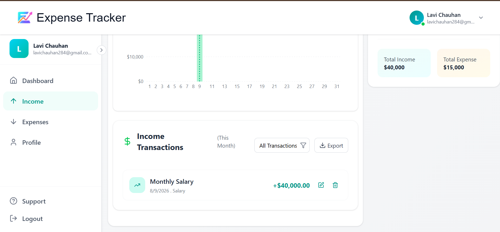
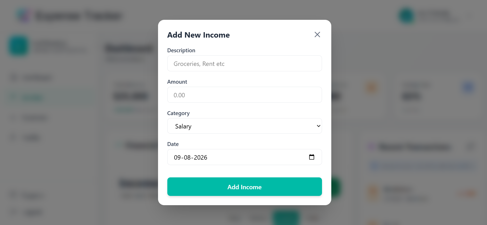

Users can:

* Add income
* View income transactions
* Delete income records
* Track income sources and amounts

### 💸 Expense Management

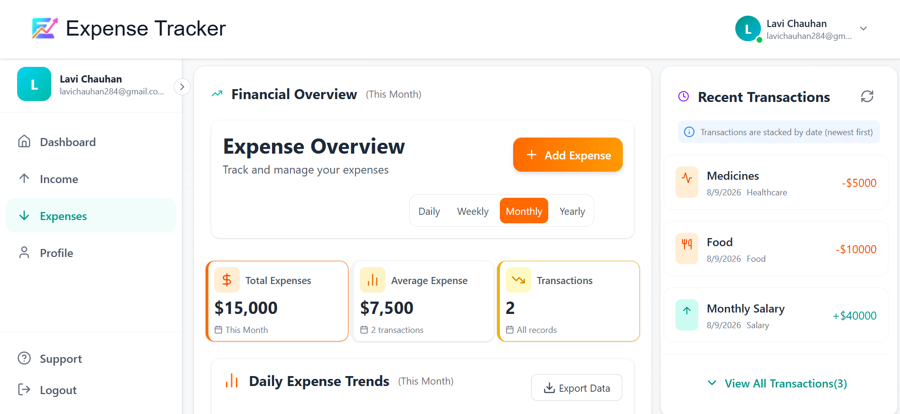
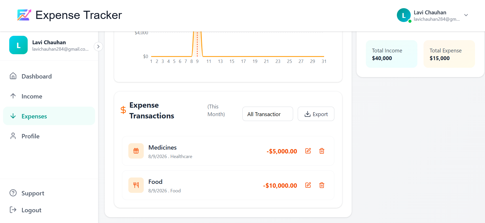
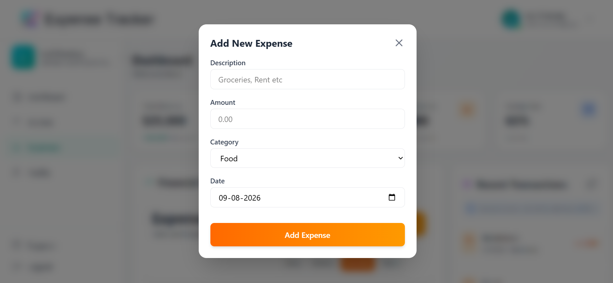

Users can:

* Add expenses
* Categorize expenses
* View expense history
* Delete transactions

### 📊 Financial Analytics

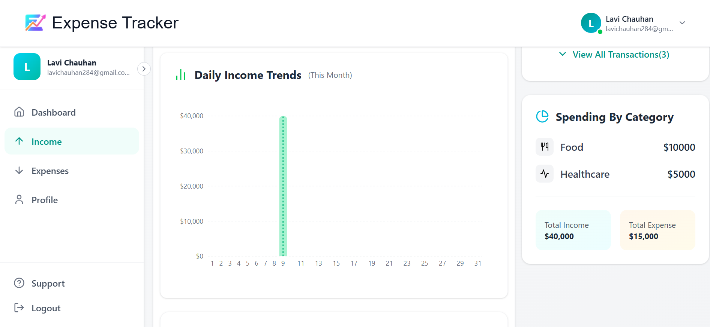
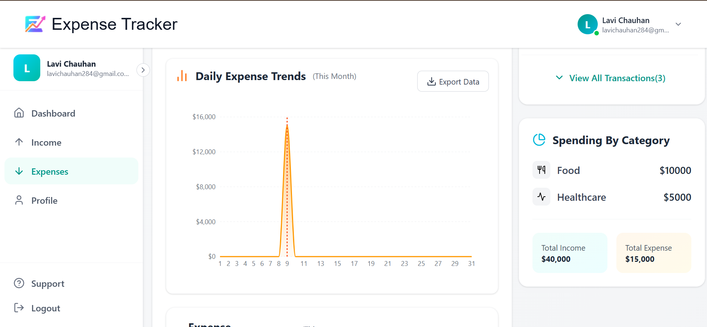

Interactive charts help users understand their:

* Income trends
* Expense trends
* Monthly spending
* Saving

### 🔐 Authentication

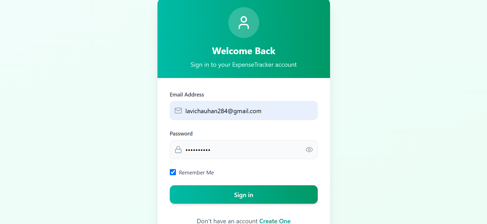
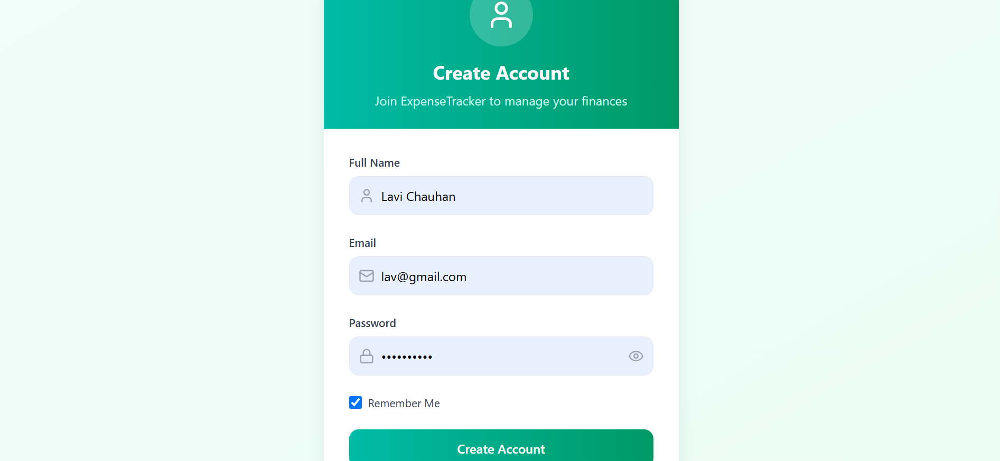

The application includes secure user authentication with:

* User Registration
* Login
* JWT Authentication
* Protected Routes

---

### 👤 Profile & Edit Profile

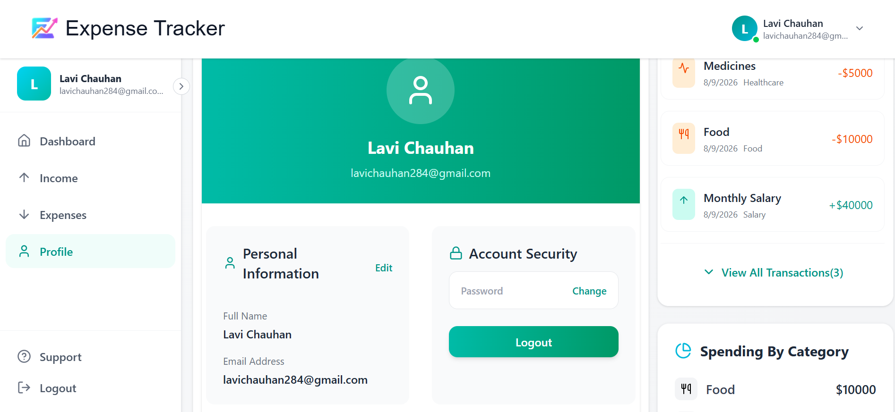

Users can:
- View their profile information
- Edit profile details
- Update personal information
- Manage their account securely

## 🚀 Features

* 🔐 User Authentication & Authorization
* 📊 Interactive Financial Dashboard
* 💰 Income Management
* 💸 Expense Management
* 🧾 Transaction History
* 📈 Income & Expense Charts
* 📅 Monthly Financial Tracking
* 🔍 Transaction Filtering
* 📱 Responsive UI
* 🗑️ Delete Transactions
* 🔒 Protected API Routes
* ⚡ Fast and Dynamic Interface

---

## 🛠️ Tech Stack

### Frontend

* React.js
* React Router
* Tailwind CSS
* Recharts
* Axios
* Lucide React

### Backend

* Node.js
* Express.js
* JWT Authentication
* REST API

### Database

* MongoDB
* Mongoose

### Tools

* Git & GitHub
* VS Code
* Postman
* MongoDB Atlas

---

## 📂 Project Structure

```text
expense-tracker/
│
├── backend/
│   ├── config/
│   ├── controllers/
│   ├── middlewares/
│   ├── models/
│   ├── routes/
|   ├── utils
│   ├── server.js
│   └── package.json
│
├── frontend/
│   ├── src/
│   │   ├── components/
│   │   ├── pages/
│   │   ├── assets/
│   │   ├── App.jsx
│   │   └── main.jsx
│   └── package.json
│
├── screenshots/
│   ├── addtransaction.png
|   ├── addincome.png
|   ├── addexpense.png
│   ├── dashboard1.png
│   ├── dashboard2.png
│   ├── dashboard3.png
│   ├── dashboard4.png
│   ├── income1.png
│   ├── income2.png
│   ├── income3.png
│   ├── expenses1.png
│   ├── expenses2.png
│   ├── expenses3.png
│   ├── profile.png
│   ├── signin.png
│   ├── signup.png
│
└── README.md
```

---

## ⚙️ Installation & Setup

### 1. Clone the Repository

```bash
git clone https://github.com/your-username/expense-tracker.git
```

### 2. Navigate to the Project

```bash
cd expense-tracker
```

### 3. Install Frontend Dependencies

```bash
cd frontend
npm install
```

### 4. Install Backend Dependencies

```bash
cd ../backend
npm install
```

### 5. Start Backend

```bash
npm run dev
```

### 6. Start Frontend

Open another terminal:

```bash
cd frontend
npm run dev
```

The application will run locally on the Vite development server.

---

## 🔑 Authentication Flow

The application uses **JWT-based authentication**.

```text
User
  ↓
Login / Register
  ↓
Backend Authentication
  ↓
JWT Token
  ↓
Protected Routes
  ↓
Dashboard
```

---

## 📊 Application Workflow

```text
Register / Login
       ↓
    Dashboard
       ↓
 ┌─────┴─────┐
 ↓           ↓
Income     Expenses
 ↓           ↓
Transactions
       ↓
Financial Analytics
       ↓
Track Savings
```

---

## 🎯 What I Learned

While developing this project, I gained practical experience in:

* Building a full-stack MERN application
* Creating REST APIs using Express.js
* Connecting React with backend APIs
* MongoDB database integration
* JWT authentication
* Protected routes
* CRUD operations
* State management in React
* Creating charts using Recharts
* API testing
* Git & GitHub workflow
* Debugging frontend and backend issues

---

## 👩‍💻 Author

**Lavi Chauhan**
